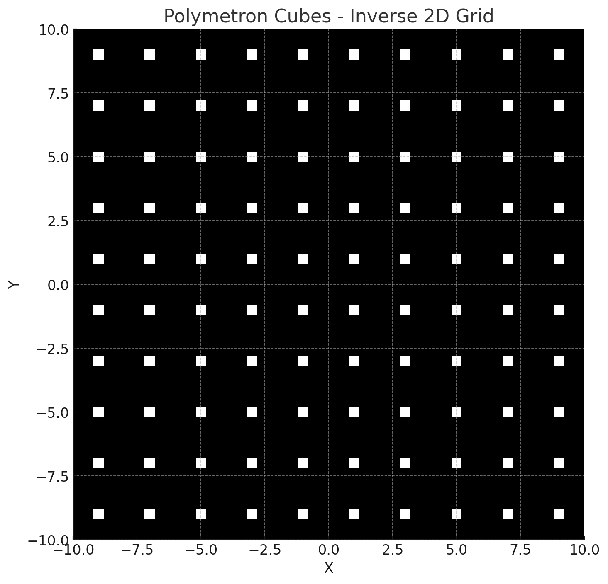
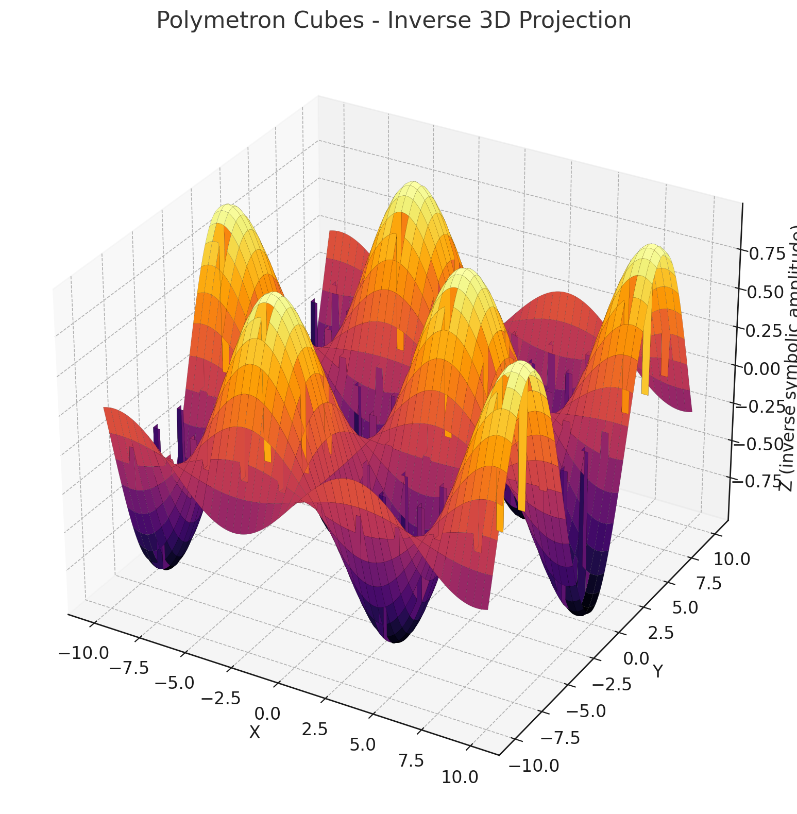
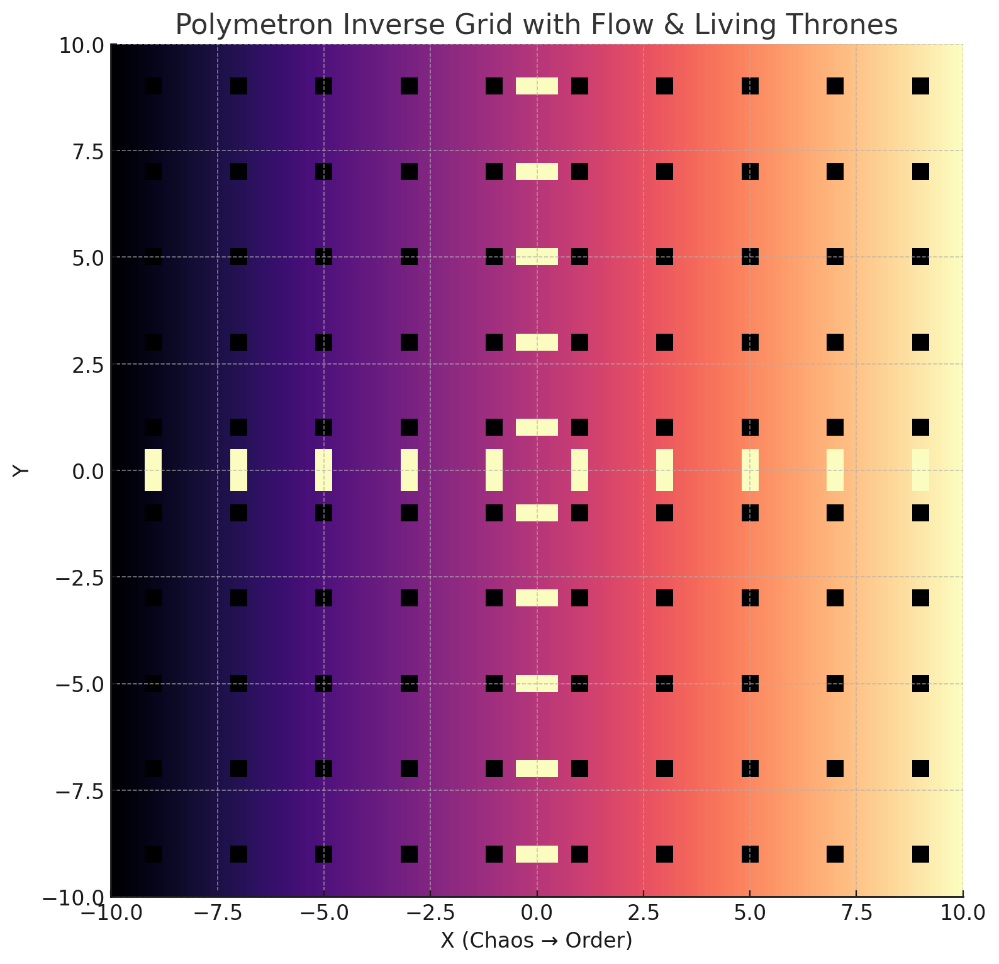
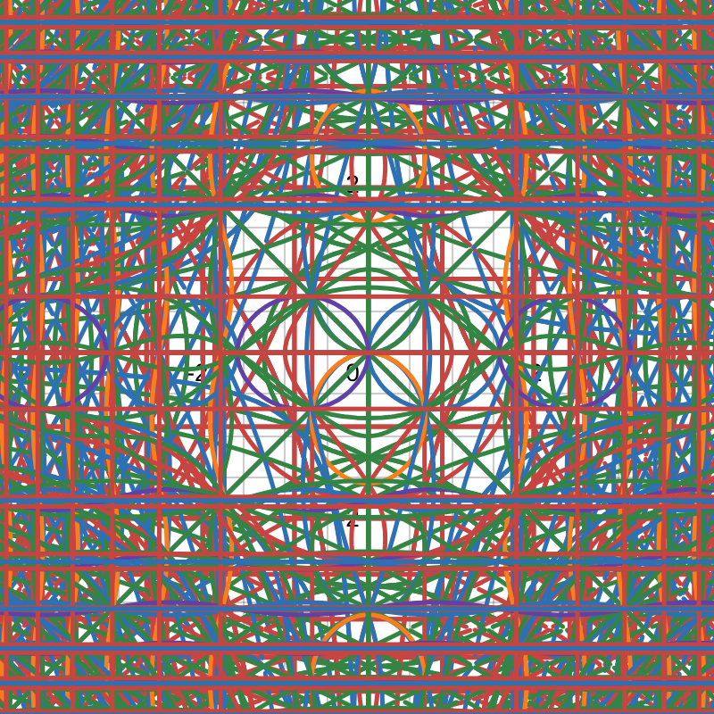

# fourdime Algebra Example Library

This repository showcases an example library for a **fourdime-inspired pathfinding system**, including the implementation of the fourdime algebraic approach and related visualizations.

---

## 🚀 Project Overview

This project demonstrates how **fourdime algebraic principles** can be applied to classical pathfinding algorithms—such as the **A\*** algorithm—to improve scalability and efficiency.

The core idea revolves around a **fourdime initialization method** that prepares the search space dynamically, leading to enhanced performance, especially in large-scale grid environments.

### 📦 What's Included

- **🔍 Pathfinder Code**: Python implementation of the fourdime algebraic pathfinding method.
- **📊 Graph Visualizations**: Plots and graphs (via `matplotlib`, `numpy`, etc.) to visualize the impact of fourdime equality on pathfinding behavior.
- **🖼️ New Symbolic Visuals**: A suite of 2D and 3D plots representing the symbolic architecture of fourdime algebra structures, including:
  - Polymetron Grid (Flat)
  - Inverse Grid (3D structure)
  - Chaos-to-Order Flow with Thrones (Ikigai core logic)

> ⚠️ This project is intended as a **demonstration only** and is not an actively maintained development effort.

---

## 🛠️ How to Use

### 1. Clone the Repository

```bash
git clone 
```
```bash
pip install -r requirements.txt
```
```bash
python qastar_quantum_init_complex.py
```

---

## 📈 Explore Visualizations

The repository includes scripts to generate visual representations of fourdime algebra's influence on pathfinding and symbolic computation.

### 🔗 Links to Interactive Graphs

- [Desmos Graph 1](https://www.desmos.com/calculator/09puuicvno)
- [Desmos Graph 2](https://www.desmos.com/calculator/axybormp2u) — How fourdime dimensions are represented by equalities
- [Desmos Final Graph: Polymetron Engine](https://www.desmos.com/calculator/s4sr4zwi1o) — Full layered system of Thrones, Seats, Flow, and Inversion
- [GeoGebra Graph 1](https://www.geogebra.org/calculator/vgykk8nw)
- [GeoGebra Graph 2](https://www.geogebra.org/calculator/bkbddeec)
- [Paper on subject](https://zenodo.org/records/15163031)

Use these to explore how the **fourdime equality** behaves in different scenarios and how it influences symbolic pathfinding and computation.

### 🔗 Links to Shader Visuals

- [Sidis Checkerboard 2D](https://www.shadertoy.com/view/cdVBDt) — ShaderToy
- [Sidis Checkerboard 3D](https://cineshader.com/view/cdVBDt) — CineShader
- [Gaussian Depth Sort](https://www.shadertoy.com/view/t32GzK) — Shader fork for fourdime optimization demo

---

## 🌌 Featured Images

### Polymetron Flat Grid


### Polymetron Inverse 3D


### Chaos to Order Flow


### Desmos Graph of Polymetron Cube


These symbolic renderings demonstrate the spatial and temporal logic structure of the fourdime algebra pathfinding system.

